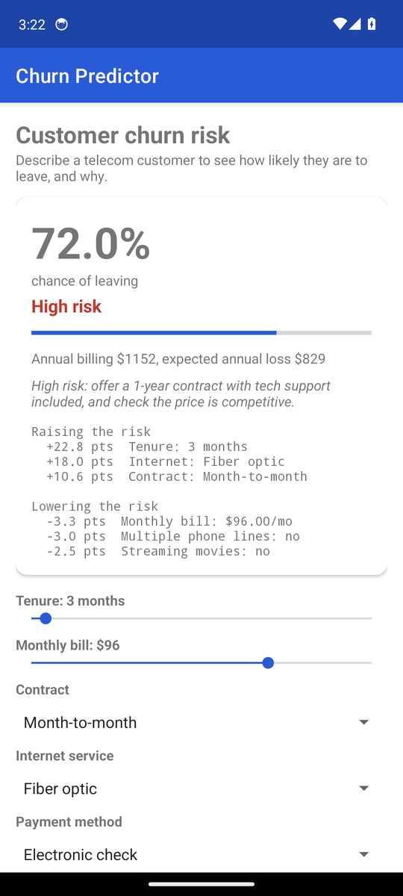
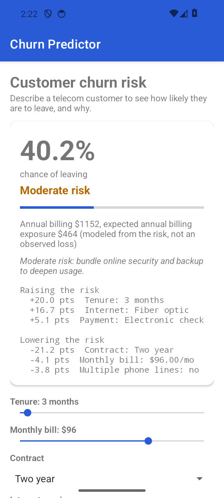

# Churn Predictor (Android)

[](https://github.com/jayraj0975/churn-predictor-android/actions/workflows/ci.yml)

A native Android app (Java) that predicts how likely a telecom customer is to leave. Describe the
customer (tenure, bill, contract, services, payment, household) and it shows the churn probability,
a risk band, the factors raising and lowering the risk, and a suggested retention step. Everything is
computed **on the device**, with no network and no backend.

**Try it:** download the debug APK from the [latest release](https://github.com/jayraj0975/churn-predictor-android/releases/latest) and install it on an Android phone (7.0+). It is a debug build, so Android will ask you to allow installing from that source.

Part of a small set: [`customer-churn-analysis`](https://github.com/jayraj0975/customer-churn-analysis) (the analysis),
[`churnapp`](https://github.com/jayraj0975/churnapp) (the web app) and this Android client. All three
use the same trained model.

## The model

A logistic regression fitted on IBM's public Telco Customer Churn data
(7,032 customers, 27% churn) and scored on a 1,407-customer held-out
test set: **ROC-AUC 0.834** (95% interval 0.811 to 0.856), well calibrated, so
"70%" means about 70 in 100 similar customers left. It was trained unweighted on purpose, which keeps the
probabilities honest. Driver figures are the model's associations, not proven causes.

`model/model.json` is that model exported from the web app's trainer. `tools/generate_model.py` turns it into
plain Java constants (`ModelData.java`) and the test fixtures, so scoring is
`sigmoid(intercept + sum(coefficient x value))` in pure Java.

## Verified

- **7 unit tests** run on a plain JVM: the Java model matches **scikit-learn's own predictions to 1e-9**
  on eight real customers; probabilities move the way the data shows (longer contract, longer tenure and automatic
  payment lower risk); the model is calibrated on the held-out set; bands, driver signs and the expected-loss
  arithmetic are checked.
- **Builds** with Gradle 9.7.1, Android Gradle Plugin 9.4.1 and JDK 17 (`assembleDebug`), and **Android lint passes** with errors set to fail the build.
- CI regenerates the model constants and fails if they differ from what is committed.

**Run on an emulator.** I installed the debug APK on an Android 14 (API 34, x86_64, hardware-accelerated) emulator: it
launches without a crash, and the on-screen probability matches an independent calculation from `model/model.json`
(72.0% for the default customer; choosing a two-year contract in the UI recomputes it to 40.2% and moves the band to Moderate).
It has **not** been tried on a physical phone.

| Default customer | Two-year contract selected |
|---|---|
|  |  |

## Build and run

```bash
./gradlew testDebugUnitTest          # model tests
./gradlew assembleDebug              # app/build/outputs/apk/debug/app-debug.apk
```
Or open the folder in Android Studio and run it. Needs JDK 17 and the Android SDK (API 34).

To update the model: replace `model/model.json` with a new export, then `python3 tools/generate_model.py`.

## Structure

```
app/src/main/java/com/jayraj/churnpredictor/
  ChurnModel.java     scoring, drivers, risk bands (no Android imports)
  ModelData.java      GENERATED coefficients and metrics
  MainActivity.java   the one screen
app/src/test/         JVM unit tests and generated fixtures
model/model.json      the exported model
tools/generate_model.py
```

## License

MIT
